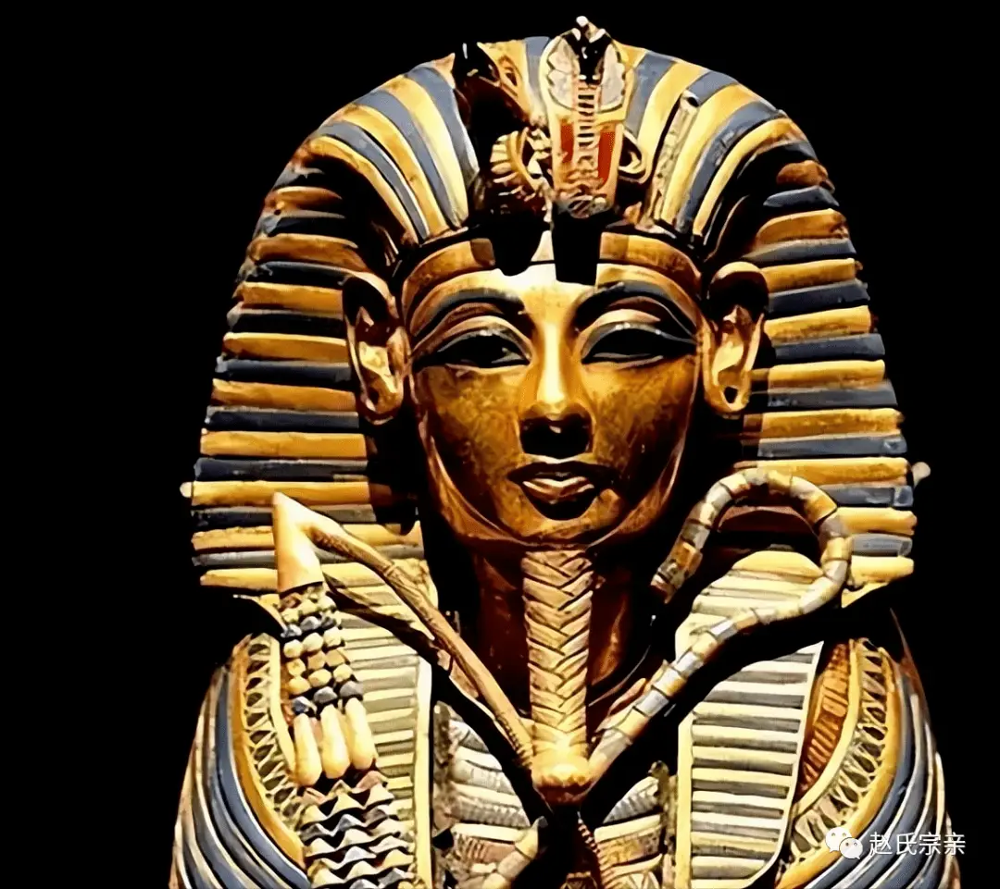
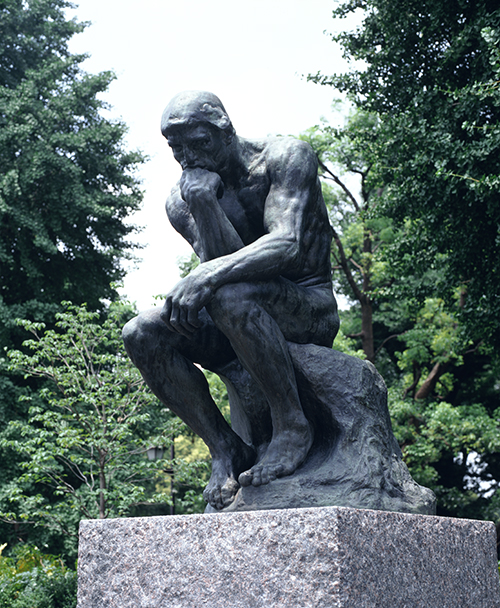

# 曼德拉效应与AI安全

老高和小莫他们的“五岁抬头团”有一个 Logo，是法老的卡通头像：

法老的头上顶着的是一只小蛇，但实际上，真正法老的头上顶的是一大一小两头蛇:

而很多人的印象，是只有一头蛇的法老。

这被很多人称为“曼德拉效应”。类似的例子还有很多：

1. 思考者雕像：手到底是托着下巴，还是抵着额头？

2. 歌曲歌词：到底是“56个民族，56朵花”，还是“56个星座，56枝花”？

这些所谓的曼德拉效应，最开始我们看过去的时候，可能只是觉得它在艺术审美上有点瑕疵，不会产生什么太大的问题。

但实际上，如果我们仔细想想，那些不美观、不协调、不对称，甚至在某种意义上的不完美，居然能够被广泛接受 —— 它一定是被广泛接受了，所以直到今天，才被所谓的曼德拉效应，或者说来自另外一条时间线上的人们开始反复质疑。

美感涉及到什么？它不仅涉及到艺术，也涉及到流程、涉及到设计的合理性，甚至涉及到程序和控制系统的合理性。

这就是很麻烦的问题：

如果你的程序和控制系统出现了这种对于“从其他时间线上来的人”而言显而易见的缺陷与不和谐，而它居然还存在在系统当中，那么这或将是非常危险的。

大家都知道我在说的是什么系统和什么程序：

是事关成败的程序，和事关人命的系统。

我想，这或许就是我们这些从另外时间线来的人，对于这个时间线的地球的价值。我们能够看到那些不和谐的地方，看到那些不合理的设计和流程，甚至看到那些不安全隐患。

我们都知道 AI 大模型是什么，它是人类的统计平均 —— 这就是真正危险的地方：

当有那么一群人，他们所创造的东西往往带有一种审美上的瑕疵，而这种审美上的瑕疵甚至与程序和系统的合理性有关，而这种合理性又可能会带来不安全性 —— 

那么，由这样的人产生的数据所训练出来的AI，它所产出的无论是程序还是系统，是安全的吗？

AI会不会受到“五十六个星座，五十六朵花”的时间线上的人的数据的污染呢？